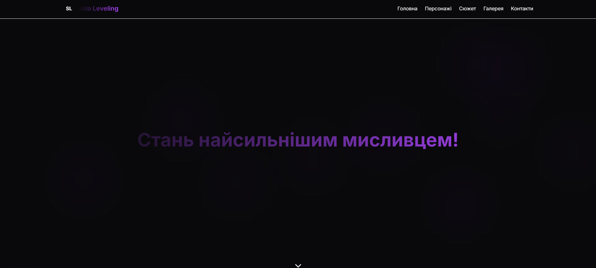
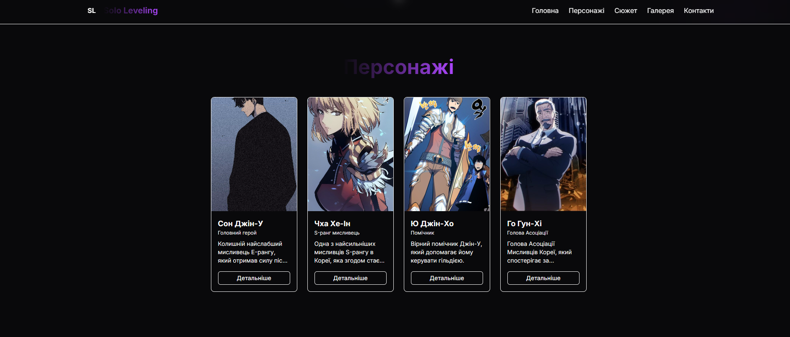
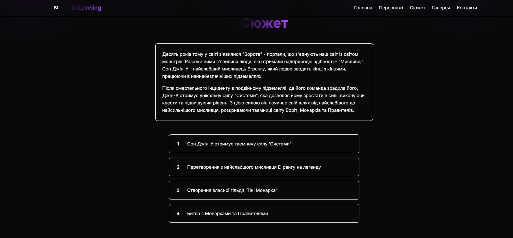
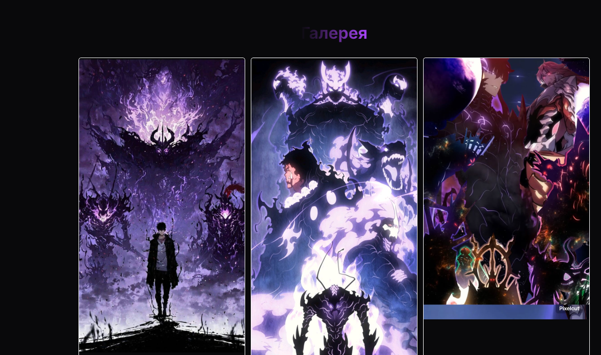
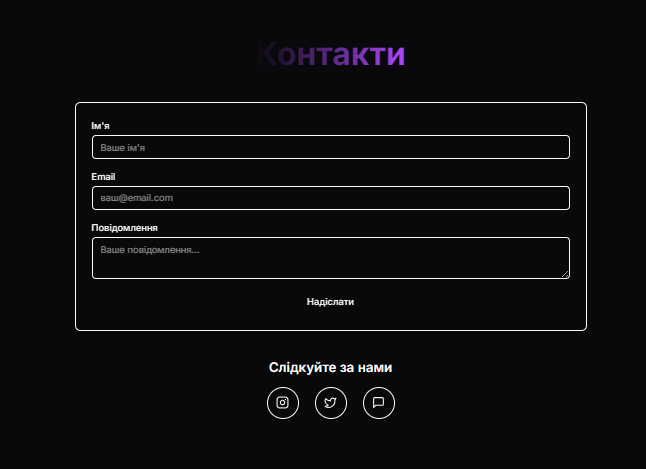

<h1 align="center"> ⚔️ Solo Leveling — Anime Web Experience ⚔️ </h1>


<h1 align="left"> :blue_book: About</h1>


</br>


- Framework: [**Next.js (App Router)**](https://nextjs.org/)
- Styling: [**Tailwind CSS**](https://tailwindcss.com/)
- Animation: [**GSAP**](https://greensock.com/gsap/)
- UI Components: [**shadcn/ui**]
- Icons: [**Lucide**](https://lucide.dev/)
- Fully responsive: **Yes**
- Anime: [**Solo Leveling**](https://en.wikipedia.org/wiki/Solo_Leveling)

## 🌟 Features

- **Responsive Design** - fully adapted for all devices
- **Dark Theme** - stylish dark interface with purple accents
- **Smooth Animations** - using GSAP for stunning effects
- **Contact System** - full-featured feedback form with database
- **Admin Panel** - contact management and statistics
- **SEO Optimized** - configured meta tags and structure
- **TypeScript** - full typing for code reliability

## 📋 Table of Contents

- [Installation](#installation)
- [Project Structure](#project-structure)
- [Usage](#usage)
- [API](#api)
- [Deployment](#deployment)
- [Technologies](#technologies)
- [Contributing](#contributing)
- [License](#license)

## 🖼️ Gallery 
 





## 🛠 Installation

### Prerequisites

- Node.js 18.0 or newer
- npm, yarn, or pnpm

### Step 1: Clone the repository

```bash
git clone https://github.com/6mjkx9/web_Solo_Level.git
cd solo-leveling-website
```
### Step 2: Install dependencies
```bash
npm install
# or
yarn install
# or
pnpm install
```
### Step 3: Database setup

SQLite database is created automatically on first run. The database file will be located in the `data/contacts.db` folder.

### Step 4: Run the project

```bash
npm run dev
# or
yarn dev
# or
pnpm dev
```

Open [http://localhost:3000](http://localhost:3000) in your browser.

## 📁 Project Structure

```
solo-leveling-website/
├── 📁 app/                          # Next.js App Router
│   ├── 📁 admin/
│   │   └── 📁 contacts/             # Admin panel
│   │       ├── loading.tsx          # Loading component
│   │       └── page.tsx             # Main admin page
│   ├── 📁 api/                      # API routes
│   │   └── 📁 contacts/
│   │       ├── 📁 [id]/             # Dynamic routes for contacts
│   │       │   └── route.ts         # CRUD operations for individual contact
│   │       ├── 📁 stats/            # Contact statistics
│   │       │   └── route.ts         # Statistics API
│   │       └── route.ts             # Main CRUD operations
│   ├── globals.css                  # Global styles
│   ├── layout.tsx                   # Root layout
│   └── page.tsx                     # Homepage
├── 📁 components/                   # React components
│   ├── 📁 ui/                       # shadcn/ui components
│   │   ├── badge.tsx
│   │   ├── button.tsx
│   │   ├── card.tsx
│   │   ├── dialog.tsx
│   │   ├── input.tsx
│   │   ├── sheet.tsx
│   │   └── textarea.tsx
│   ├── characters-section.tsx       # Characters section
│   ├── contact-section.tsx          # Contact form
│   ├── gallery-section.tsx          # Image gallery
│   ├── header.tsx                   # Navigation header
│   ├── hero-section.tsx             # Hero section
│   ├── story-section.tsx            # Story section
│   └── theme-provider.tsx           # Theme provider
├── 📁 hooks/                        # Custom React hooks
│   └── use-toast.ts                 # Toast notifications hook
├── 📁 lib/                          # Utilities and configuration
│   ├── database.ts                  # Database operations
│   └── utils.ts                     # Helper functions
├── 📁 scripts/                      # SQL scripts
│   └── init-database.sql            # Database initialization
├── 📁 data/                         # Database (created automatically)
│   └── contacts.db                  # SQLite database
├── 📄 package.json                  # Project dependencies
├── 📄 tailwind.config.ts            # Tailwind CSS configuration
├── 📄 postcss.config.mjs            # PostCSS configuration
├── 📄 tsconfig.json                 # TypeScript configuration
└── 📄 README.md                     # Project documentation
```

## 🎯 Usage

### Main website sections

1. **Hero Section** - welcome screen with animations
2. **Characters** - interactive gallery of anime characters
3. **Story** - description of Solo Leveling storyline
4. **Gallery** - collection of images with modal windows
5. **Contact** - feedback form with validation

### Admin Panel

Available at `/admin/contacts` and includes:

- 📊 Contact statistics
- 🔍 Contact search
- 📝 Message status management
- 🗑️ Contact deletion
- 📈 Interaction analytics

### Contact Form

- ✅ Real-time validation
- 📧 Email format verification
- 💾 Automatic database saving
- 🔔 Success notifications

## 🔌 API

### Endpoints

#### Contacts

```http
GET    /api/contacts              # Get all contacts
POST   /api/contacts              # Create new contact
GET    /api/contacts/[id]         # Get contact by ID
PUT    /api/contacts/[id]         # Update contact status
DELETE /api/contacts/[id]         # Delete contact
GET    /api/contacts/stats        # Get statistics
```

#### Example request

```javascript
// Creating a new contact
const response = await fetch('/api/contacts', {
  method: 'POST',
  headers: {
    'Content-Type': 'application/json',
  },
  body: JSON.stringify({
    name: 'John Doe',
    email: 'john@example.com',
    message: 'Hello! I really like your website!'
  })
});

const result = await response.json();
```

#### Response structure

```json
{
  "success": true,
  "message": "Contact successfully saved",
  "data": {
    "id": 1,
    "name": "John Doe",
    "email": "john@example.com",
    "message": "Hello! I really like your website!",
    "created_at": "2024-01-15T10:30:00.000Z",
    "status": "new"
  }
}
```

## 🚀 Deployment

### Vercel (Recommended)

1. Connect repository to Vercel
2. Configure environment variables (if needed)
3. Deploy the project

```bash
npm run build
```

### Netlify

1. Create `netlify.toml` file:

```toml
[build]
  command = "npm run build"
  publish = ".next"

[[redirects]]
  from = "/*"
  to = "/index.html"
  status = 200
```

### Docker

```dockerfile
FROM node:18-alpine

WORKDIR /app
COPY package*.json ./
RUN npm ci --only=production
COPY . .
RUN npm run build

EXPOSE 3000
CMD ["npm", "start"]
```

## 🛠 Technologies

### Frontend
- **Next.js 15** - React framework with App Router
- **TypeScript** - static typing
- **Tailwind CSS 4** - utility-first CSS framework
- **shadcn/ui** - component library
- **GSAP** - animations and interactivity
- **Lucide React** - icons

### Backend
- **Next.js API Routes** - server endpoints
- **SQLite** - lightweight database
- **better-sqlite3** - fast SQLite driver

### Development Tools
- **ESLint** - code linting
- **Prettier** - code formatting
- **PostCSS** - CSS processing

## 📱 Responsive Design

The website is fully responsive for:
- 📱 Mobile devices (320px+)
- 📱 Tablets (768px+)
- 💻 Desktop (1024px+)
- 🖥️ Large screens (1440px+)

## 🎨 Customization

### Changing color scheme

Edit the `app/globals.css` file:

```css
:root {
  --primary: 267 75% 60%;        /* Primary color */
  --primary-foreground: 0 0% 98%; /* Text on primary color */
  /* ... other variables */
}
```

### Adding new sections

1. Create component in `components/` folder
2. Import in `app/page.tsx`
3. Add to navigation in `components/header.tsx`

## 🤝 Contributing

We welcome contributions to the project! Please follow these steps:

1. Fork the repository
2. Create a feature branch (`git checkout -b feature/amazing-feature`)
3. Commit your changes (`git commit -m 'Add amazing feature'`)
4. Push to the branch (`git push origin feature/amazing-feature`)
5. Open a Pull Request

### Code Guidelines

- Use TypeScript for all new files
- Follow ESLint configuration
- Write descriptive commits
- Add comments for complex logic

## 🐛 Bug Reports

If you find a bug, please:

1. Check if a similar issue already exists
2. Create a new issue with detailed description
3. Include steps to reproduce the bug
4. Add screenshots if possible


## 👥 Authors

- **Solo Leveling Development Team** - *Initial work*

## 🙏 Acknowledgments

- Next.js team for the amazing framework
- shadcn/ui creators for beautiful components
- Solo Leveling community for inspiration

## 🌟 Show your support

Give a ⭐️ if this project helped you!


---

<div align="center">
  <p>Made with ❤️ for Solo Leveling fans</p>
  <p>
    <a href="#top">⬆️ Back to top</a>
  </p>
</div>